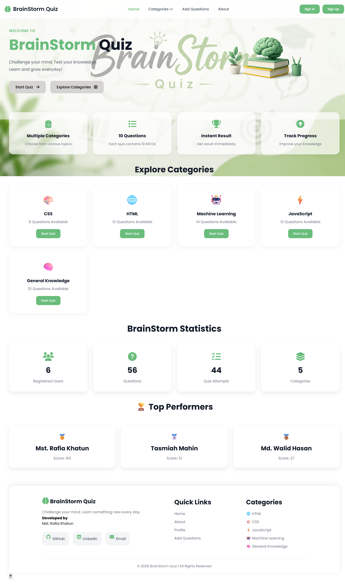
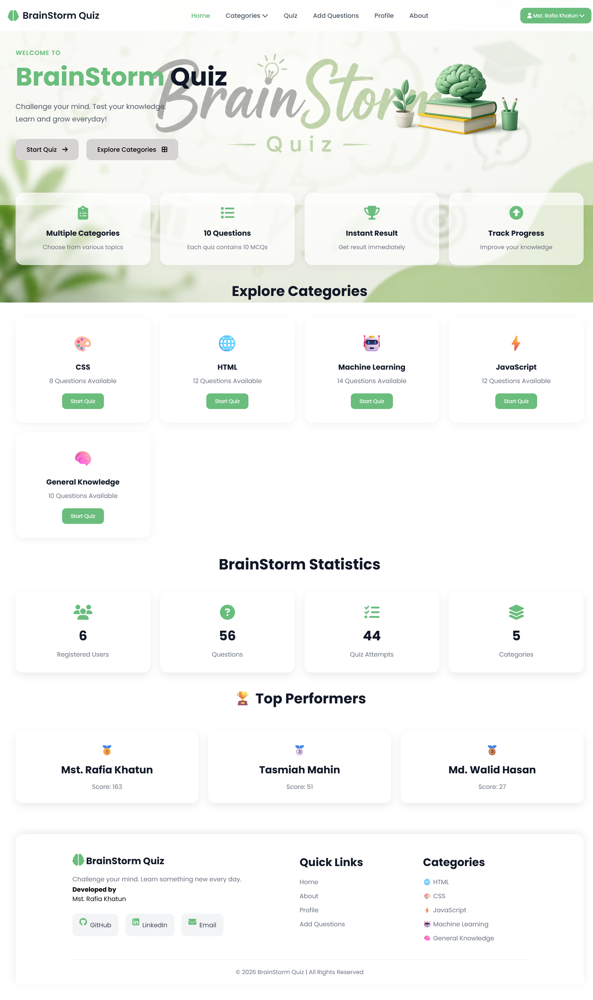
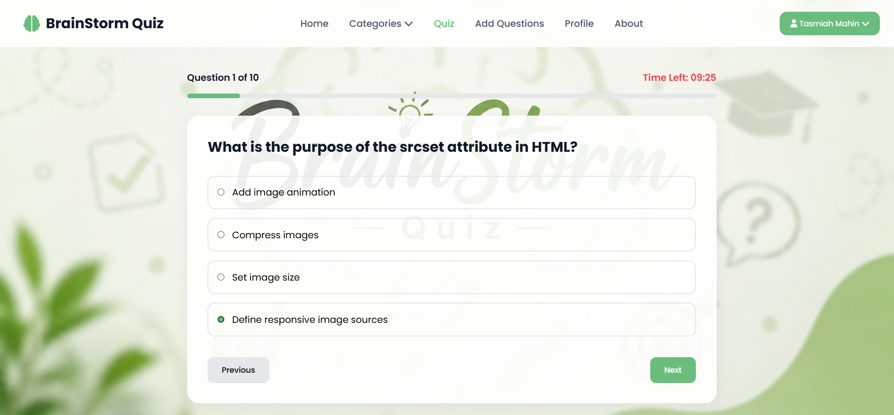
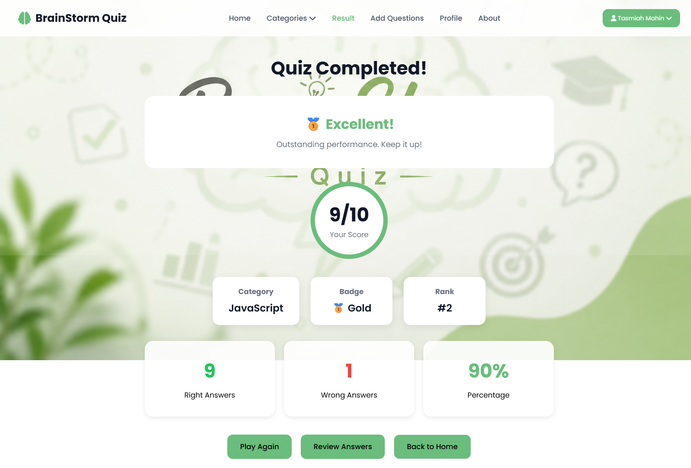
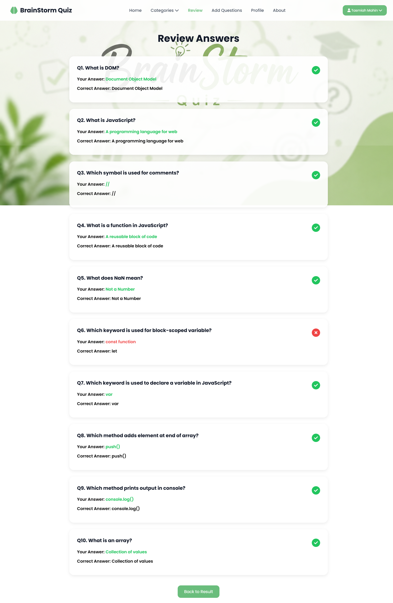
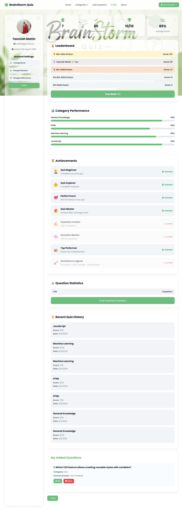
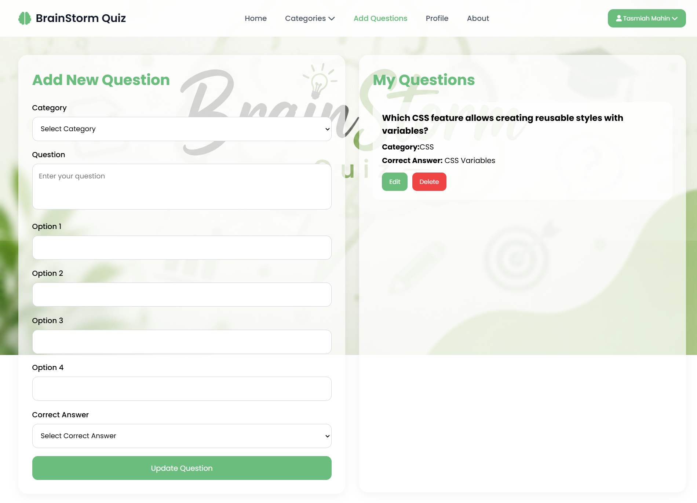
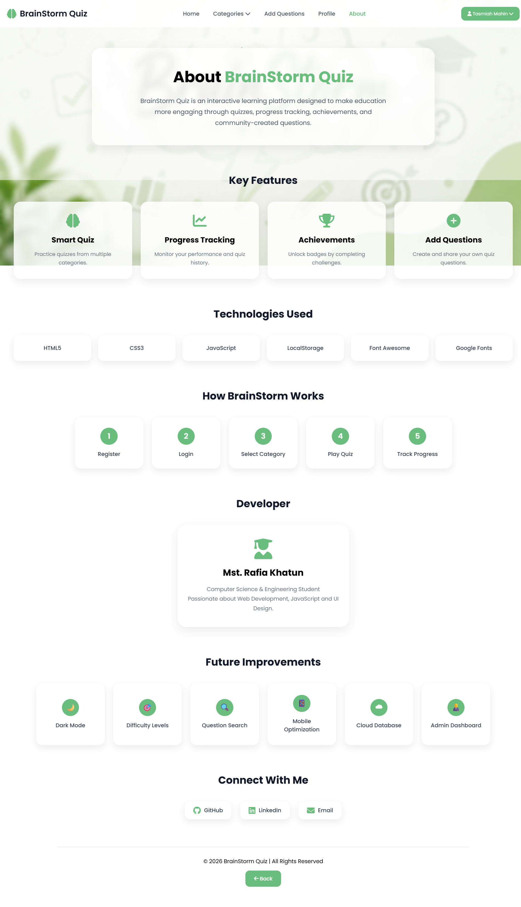

# 🧠 BrainStorm Quiz

**BrainStorm Quiz** is an interactive web-based quiz platform designed
to help users test and improve their knowledge through multiple-choice
quizzes.

The project provides a simple and user-friendly interface with quiz
categories, question management, result tracking, profile statistics,
and a review system.

> **Current version:** Frontend-based application using HTML, CSS,
> JavaScript, and LocalStorage.\
> **Planned upgrade:** PHP + MySQL backend for persistent database
> storage and secure authentication.

------------------------------------------------------------------------

## ✨ Features

-   🔐 User Registration and Login
-   🔑 Forgot Password interface
-   🧠 Interactive Quiz System
-   📚 Multiple Quiz Categories
-   ➕ Add New Questions
-   ✏️ Edit Questions
-   🗑️ Delete Questions
-   📊 Quiz Result and Score
-   🔍 Review Quiz Questions
-   👤 User Profile
-   📈 User Performance Statistics
-   🏆 Top Performers / Leaderboard
-   📜 Quiz Attempt History
-   📱 Responsive User Interface
-   💾 LocalStorage-based data management

------------------------------------------------------------------------

## 🛠️ Technologies Used

  Technology          Purpose
  ------------------- ------------------------------------
  HTML5               Website structure
  CSS3                Styling and responsive design
  JavaScript (ES6+)   Application logic and interactions
  LocalStorage        Client-side data storage
  Font Awesome        Icons
  Google Fonts        Typography

### Planned Backend Technologies

-   PHP
-   MySQL
-   phpMyAdmin
-   XAMPP

------------------------------------------------------------------------

## 📂 Project Structure

``` text
BrainStorm-Quiz/
│
├── index.html
├── style.css
├── homepg.js
├── background.png
├── brain.png
│
├── about/
│   ├── about.html
│   ├── about.css
│   └── about.js
│
├── add question/
│   ├── add-questions.html
│   ├── add-questions.css
│   └── add-questions.js
│
├── quiz-question/
│   ├── quiz.html
│   ├── quiz.css
│   └── quiz.js
│
├── result/
│   ├── result.html
│   ├── result.css
│   └── result.js
│
├── review-question/
│   ├── review.html
│   ├── review.css
│   └── review.js
│
├── profile/
│   ├── profile.html
│   ├── profile.css
│   └── profile.js
│
├── sign-up-in page/
│   ├── login.html
│   ├── login.js
│   ├── register.html
│   ├── register.js
│   ├── forgot-pass.html
│   ├── forgott-pass.js
│   └── ...
│
├── js/
│   ├── auth.js
│   ├── category-dropdown.js
│   └── quiz-navigation.js
│
├── screenshot/
│   ├── about.png
│   ├── addquestion.png
│   ├── homepage.png
│   ├── homepage with dropdown.png
│   ├── homepage_with_login.png
│   ├── profile.png
│   ├── question_review.png
│   ├── quiz.png
│   └── result.png
│
└── README.md
```

------------------------------------------------------------------------

# 📸 Screenshots

## 🏠 Home Page



------------------------------------------------------------------------

## 📚 Home Page --- Category Dropdown


------------------------------------------------------------------------

## 👤 Home Page --- After Login



------------------------------------------------------------------------

## 🧠 Quiz Page



------------------------------------------------------------------------

## 🏆 Result Page



------------------------------------------------------------------------

## 🔍 Question Review



------------------------------------------------------------------------

## 👤 Profile Page



------------------------------------------------------------------------

## ➕ Add Question Page



------------------------------------------------------------------------

## ℹ️ About Page



------------------------------------------------------------------------

# 🚀 How to Run

## Option 1 --- Open Directly

1.  Download or clone the repository.
2.  Open the project folder.
3.  Double-click `index.html`.
4.  The website will open in your browser.

## Option 2 --- VS Code Live Server

1.  Open the project in **Visual Studio Code**.
2.  Install the **Live Server** extension.
3.  Right-click `index.html`.
4.  Select **Open with Live Server**.
5.  The application will open in your default browser.

------------------------------------------------------------------------

# 💾 Current Data Storage

The current version uses **Browser LocalStorage** to store application
data.

Examples include:

-   User information
-   Login state
-   Quiz questions
-   Quiz results
-   Quiz history
-   User statistics

### ⚠️ Current Limitation

Because LocalStorage is browser-based:

-   Data is stored only on the user's device/browser.
-   Data is not shared between different users or devices.
-   It is not suitable for secure production authentication.
-   Clearing browser storage can remove the stored data.

------------------------------------------------------------------------

# 🔮 Future Backend Development

The next version of BrainStorm Quiz will migrate from LocalStorage to a
**PHP + MySQL backend**.

### Proposed Architecture

``` text
Frontend
HTML + CSS + JavaScript
          │
          ▼
        PHP
          │
          ▼
       MySQL
```

### Proposed Database Tables

``` text
users
categories
questions
quiz_attempts
answers
```

### Planned Backend Features

-   Secure user authentication
-   Password hashing using `password_hash()`
-   Password verification using `password_verify()`
-   Database-based question management
-   Persistent quiz history
-   Global leaderboard
-   User-specific statistics
-   Admin panel
-   Server-side validation
-   Improved security

------------------------------------------------------------------------

# 🎯 Project Goals

The main goals of BrainStorm Quiz are:

1.  Provide an easy-to-use online quiz platform.
2.  Allow users to practice different subjects.
3.  Track users' quiz performance.
4.  Provide detailed quiz results and question reviews.
5.  Allow questions to be managed efficiently.
6.  Build a foundation for a scalable PHP + MySQL quiz application.

------------------------------------------------------------------------

# 🔐 Security Considerations

The current frontend version is intended for learning and demonstration
purposes.

For the future PHP + MySQL version, sensitive operations should be
handled on the server.

Recommended security practices include:

-   Password hashing
-   Prepared SQL statements
-   Server-side input validation
-   Session-based authentication
-   Authorization checks
-   Protection against SQL Injection
-   Protection against XSS
-   Secure session handling

------------------------------------------------------------------------

# 📌 Future Improvements

-   [ ] PHP + MySQL backend
-   [ ] Admin dashboard
-   [ ] Secure authentication
-   [ ] Database-based question management
-   [ ] Global leaderboard
-   [ ] Timer-based quizzes
-   [ ] Difficulty levels
-   [ ] More quiz categories
-   [ ] Search and filtering
-   [ ] User achievements
-   [ ] Email-based password reset
-   [ ] Deployment to a live server
-   [ ] REST API integration

------------------------------------------------------------------------

# 👩‍💻 Developer

**Mst. Rafia Khatun**

-   GitHub: [rafia419](https://github.com/rafia419)
-   LinkedIn: [Mst. Rafia
    Khatun](https://www.linkedin.com/in/mst-rafia-khatun-811391426)

------------------------------------------------------------------------

## ⭐ Project Status

**Frontend Version:** Completed\
**Backend Migration:** Planned\
**Technology Upgrade:** PHP + MySQL

------------------------------------------------------------------------

⭐ If you find this project useful, consider giving the repository a
star!
